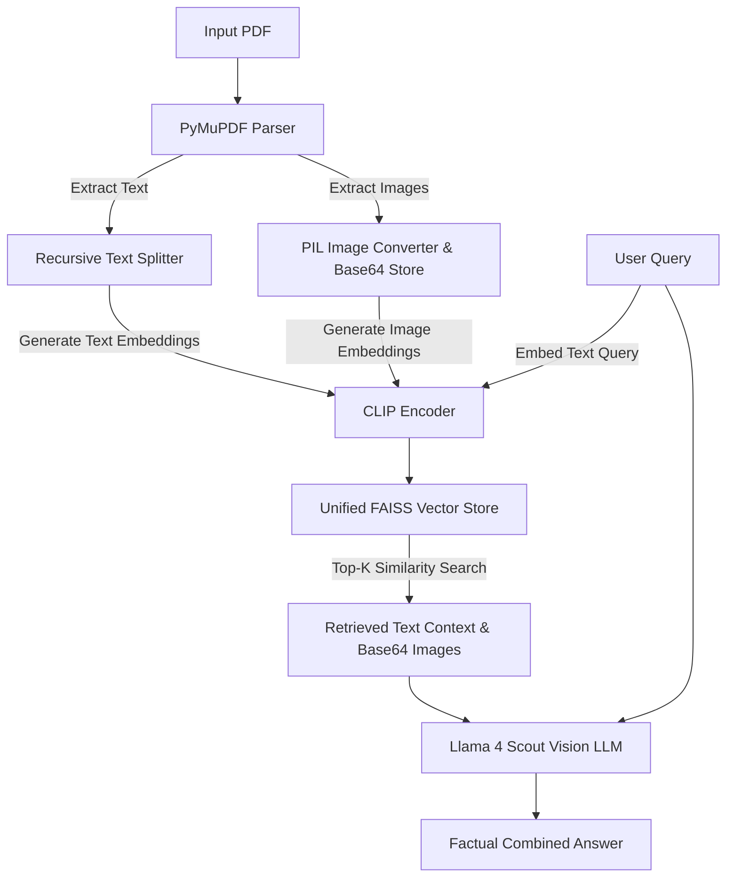

# 🤖 RAG Mastery: Advanced Document & Multimodal Pipelines

[](https://www.python.org/)
[](https://langchain.com/)
[](https://groq.com/)
[](https://github.com/facebookresearch/faiss)
[](https://www.trychroma.com/)
[](https://huggingface.co/openai/clip-vit-base-patch32)

Welcome to **RAG Mastery**, a progressive portfolio demonstrating the construction of enterprise-grade **Retrieval-Augmented Generation (RAG)** systems. This project ranges from foundational document loaders to an advanced **Multimodal RAG** pipeline capable of parsing, indexing, and reasoning over both text paragraphs and raw image assets (charts, graphs, and figures) inside PDFs.

---

## 📂 Repository Structure & Technical Specifications

This repository is structured as a progressive learning path to master RAG. Below are the technical breakdowns of each notebook:

### 1. 📘 `document.ipynb` (Foundational)
*   **Purpose**: Introduces basic document data structures and filesystem parsing in LangChain.
*   **Key APIs**: `TextLoader`, `DirectoryLoader` (LangChain Community).
*   **Technical Specifications**:
    *   **Data Structures**: Wraps raw text content and files into LangChain `Document` schema (with custom metadata dictionary tags: `source`, `file_type`).
    *   **Parsing Scope**: Handles plain text files (`.txt`), teaching recursive directory scanning using glob patterns (`**/*.txt`).

### 2. 📙 `pdf_loader.ipynb` (Intermediate - Text-based RAG)
*   **Purpose**: Implements a complete production-grade semantic text search and generation pipeline.
*   **Key APIs**: `PyPDFLoader`, `RecursiveCharacterTextSplitter`, `SentenceTransformer` (`all-MiniLM-L6-v2`), `chromadb`, `ChatGroq`.
*   **Technical Specifications**:
    *   **Chunking Strategy**: `chunk_size = 1000` characters, `chunk_overlap = 200` characters. Uses recursive separators (`\n\n`, `\n`, ` `, `""`) to keep complete sentences and paragraphs intact.
    *   **Embedding Model**: `all-MiniLM-L6-v2` (SentenceTransformers). Generates **384-dimensional dense vectors** with a maximum sequence limit of **256 input tokens**.
    *   **Vector DB Indexing**: Persisted ChromaDB collection using **L2 (Euclidean) distance** space mapping.
    *   **Text LLM Generation**: Groq-hosted `llama-3.1-8b-instant` (Context window: **128K tokens**, Temperature: `0.1` for high factual accuracy).

### 3. 📕 `multimodal-rag-pdf-with-images.ipynb` (Advanced - Multimodal RAG)
*   **Purpose**: Builds a unified vector store to index and retrieve both text blocks and images, feeding them to a Vision LLM.
*   **Key APIs**: `fitz` (PyMuPDF), `CLIPModel` / `CLIPProcessor` (`openai/clip-vit-base-patch32`), `FAISS`, `ChatGroq`.
*   **Technical Specifications**:
    *   **Multimodal Ingestion**: Page-by-page PDF extraction. Texts are split (`chunk_size=500`, `chunk_overlap=100`). Images are extracted as raw bytes, converted to PIL format, and stored as **base64-encoded PNG strings** for direct API transmission.
    *   **Unified Embedding Model**: CLIP ViT-B/32. Maps both text inputs and images to a shared **512-dimensional vector space**. Text inputs are truncated at CLIP's limit of **77 tokens**.
    *   **Vector DB Indexing**: FAISS index built using precomputed CLIP embeddings (similarity metric: normalized dot-product/cosine similarity).
    *   **Multimodal Generation**: Groq-hosted **Llama 4 Scout** (`meta-llama/llama-4-scout-17b-16e-instruct`). Context window: **128K tokens**, Temperature: `0.1`.

---

## 🛠️ System Architecture



---

## 📊 Deep-Dive: Core Technologies & Advantages

### 1. Joint Vector Space (CLIP) vs. Traditional Search (TF-IDF / BM25)

| Metric / Feature | CLIP (Contrastive Language-Image) | Traditional (TF-IDF / BM25) |
| :--- | :--- | :--- |
| **Search Modality** | Multimodal (Text-to-Text, Text-to-Image, Image-to-Image) | Unimodal (Text-to-Text only) |
| **Search Paradigm** | Semantic / Conceptual Match (understands synonyms and visual context) | Exact Keyword Match (fails on synonyms or visual assets) |
| **Dimension Type** | Dense Vectors (e.g., 512 dimensions) | Sparse Vectors (vocabulary size, e.g., 10,000+) |
| **Visual Asset Capability** | Natively embeds images directly into the vector space | Completely blind to diagrams, charts, and tables |
| **Recruiter Takeaway** | CLIP allows recruiters to ask *"Show me the pipeline architecture"* and retrieve the actual PNG block from the PDF. | BM25 would return zero results unless the exact words were in the caption. |

### 2. Llama 4 Scout Vision vs. Standard LLMs

*   **Multimodal Reasoning**: Standard LLMs can only process text. Llama 4 Scout receives both the text context and the actual **pixel data** (via base64 data URLs) of retrieved charts, letting it read value numbers directly from graphics.
*   **Ultra-Low Latency (Groq LPU)**: Running Llama 4 Scout on Groq's LPU (Language Processing Unit) yields inference speeds upwards of **100+ tokens per second**, making interactive RAG queries instantaneous.
*   **Massive Context Window**: Llama 4 Scout's **128K token context** allows the pipeline to supply rich historical text excerpts and multiple images without hitting context limits.

---

## ⚙️ Setup & Installation Instructions

### 1. Clone the Project
```bash
git clone https://github.com/Abhishek01112002/RAG_Mastery.git
cd RAG_Mastery
```

### 2. Configure Credentials
Copy the example environment configuration:
```bash
cp .env.example .env
```
Open `.env` and fill in your Groq API Key:
```env
GROQ_API_KEY=gsk_your_key_here
```

### 3. Install Requirements
Create a virtual environment and install dependencies:
```bash
python -m venv .venv
.venv\Scripts\activate
pip install -r requirements.txt
```

### 4. Run Notebooks
Start Jupyter Lab and run the notebooks in sequence:
```bash
jupyter notebook
```

---

## ⚠️ Troubleshooting & FAQ

#### 🔍 Issue: `Error code: 400 - model_decommissioned`
*   **Cause**: Groq frequently updates its preview model catalogs. Previous model IDs like `llama-3.2-11b-vision-preview` are decommissioned.
*   **Solution**: Ensure your notebook uses **`meta-llama/llama-4-scout-17b-16e-instruct`** for multimodal vision queries, and **`llama-3.1-8b-instant`** for standard text queries.

#### 📁 Issue: `FileNotFoundError: PDF file not found at: multimodal_sample.pdf`
*   **Cause**: The pipeline is running in a directory where the target PDF file is missing.
*   **Solution**: Make sure you copy your target PDF to the notebook directory and name it `multimodal_sample.pdf`, or update the `pdf_path` variable in Phase 3.

#### 🧠 Issue: `OutOfMemoryError` or High CPU Usage during CLIP Loading
*   **Cause**: The Hugging Face `transformers` library loads CLIP weights (~600MB) into memory. On machines without a dedicated NVIDIA GPU, it defaults to CPU calculation which can be slower.
*   **Solution**: CLIP runs fine on modern CPUs. To improve performance, verify that PyTorch is configured correctly or run with a smaller chunk size to reduce parallel embedding calls.
